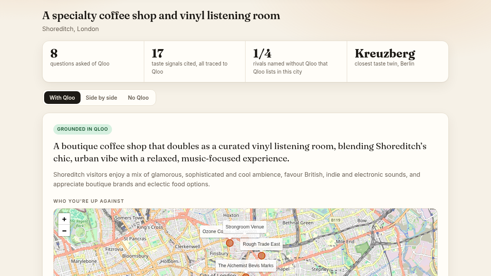
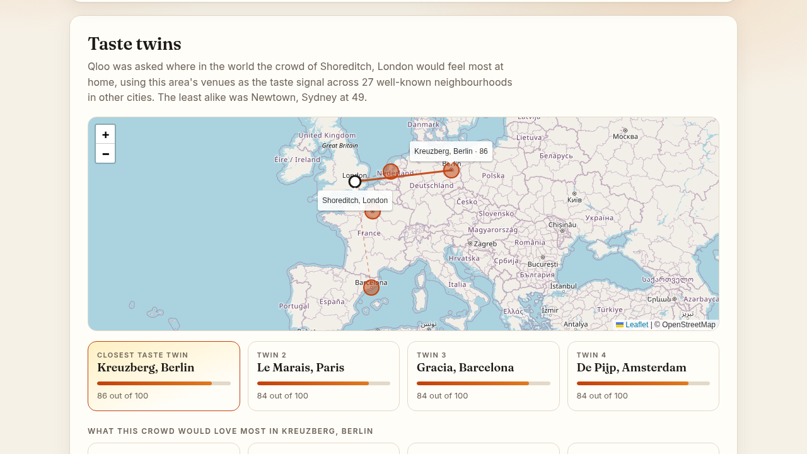
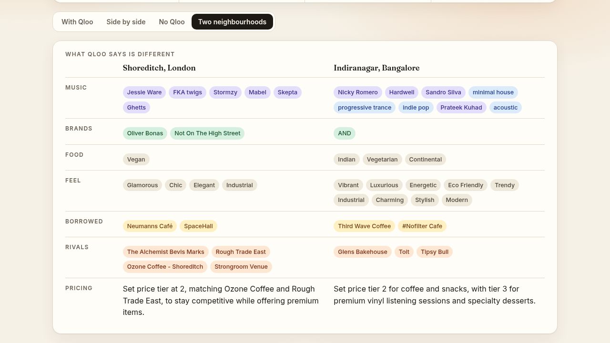

# LocalTaste

**Know the neighbourhood before you sign the lease.**

Describe the business you want to open and where, and optionally the places, brands or artists you admire. LocalTaste's agent reads the area's taste with [Qloo](https://www.qloo.com/), studies the venues you would compete with, finds the neighbourhoods around the world whose taste is closest, and writes a launch brief (menu, music, decor, partners, pricing, events, risks) in which every idea points to the Qloo signals behind it.

Built for the Qloo Agentic Hackathon.



## What makes it different

- **Taste twins.** The area's venues are used as a taste signal, and Qloo is asked where that crowd would feel most at home across 29 well-known neighbourhoods in other cities. Shoreditch pairs with Kreuzberg, Le Marais and Gràcia; Williamsburg with Wicker Park and Plateau Mont-Royal; Indiranagar with Hauz Khas and Bandra West.
- **Borrow from your twin.** The agent then asks which venues in the closest twin this crowd has the highest affinity for, and turns what they serve and how they feel into ideas to adapt, each citing the venue it came from.
- **Every idea shows its signals.** Names are checked in code against what Qloo returned; anything else is removed.
- **With and without Qloo, side by side.** The same model writes the brief with no tools. Its named rivals are looked up in Qloo and the page shows how many Qloo lists in that city.
- **Two neighbourhoods, or before and after.** Run the same concept somewhere else, or change the concept, and see a table of what moved.





## How it uses Qloo

Qloo's neighbourhood-level location signal is sparse, so LocalTaste derives an area's taste from the audiences of its venues. The agent has six tools, all backed by the Qloo API:

| Tool | Qloo query | Purpose |
|---|---|---|
| `area_taste` | Places filtered by location, then those venues as `signal.interests.entities` for artists, brands, films, TV and typed tags; city-level `signal.location` for artists | What this neighbourhood's audience favours |
| `competitors` | `/v2/tags` search restricted to place categories, then places filtered by location and tag | Comparable venues with rating, price tier, popularity, what they serve and how they feel |
| `audience_taste` | Competitor ids as signals into another domain | What the competitors' audience also loves |
| `venues_for_taste` | Entity signals ranked over places in the area | Where fans of an inspiration already go |
| `lookup` | `/search` | Resolve a named venue, brand or artist |
| `city_taste` | City-level `signal.location` | City-wide context |

Two further steps run in code after the model's research:

| Step | Qloo query | Purpose |
|---|---|---|
| `taste_twins` | This area's venues as signals, ranked over places in each atlas neighbourhood; score is the mean affinity of the ten best matches | Neighbourhoods abroad with the closest taste |
| `borrow_from` | The same signals over places of the concept's kind in the closest twin | Venues there this crowd would take to |

## How the agent works

1. **Research.** The area's taste is read first; if Qloo cannot place the location the run stops with a clear message. A planning model then chooses which Qloo tools to call. Code enforces a checklist (competitors, two audience domains, and the owner's inspirations if given) before it may stop.
2. **Ledger.** Every tool result is recorded, with each returned name typed as venue, artist, brand, film, show, genre, food or ambience.
3. **Writing.** A second model writes the brief from the ledger only, citing the names each idea rests on.
4. **Twins.** Taste twins are found and the closest one is searched for venues to borrow from.
5. **Verification in code.** Any cited name Qloo did not return is removed. An idea is dropped unless it cites the right kind of signal (music needs artists or genres, partnerships need brands, pricing needs competitors). A venue cannot be both a rival and a partner.
6. **Comparison.** The same writing model answers with no tools, for the side-by-side view. A brief with fewer than five supported ideas is not shown.

## Run it locally

Developed and tested on Python 3.14.

```bash
git clone https://github.com/ItzAditya43/localtaste.git
cd localtaste
pip install -r backend/requirements.txt
cp .env.example .env        # then add your keys
cd backend
uvicorn server:app --port 8000
```

Open http://localhost:8000. The saved examples load without any API keys.

| Variable | Purpose |
|---|---|
| `QLOO_API_KEY` | Qloo hackathon key |
| `QLOO_API_URL` | Defaults to `https://hackathon.api.qloo.com` |
| `GROQ_API_KEY` | Groq key for both models |
| `GROQ_MODEL`, `GROQ_RESEARCH_MODEL` | Optional model overrides |
| `GROQ_FALLBACK_MODELS` | Optional comma-separated models to use when one reaches its daily limit |

From the command line: `python agent.py "A natural wine bar with small plates" "Bandra West, Mumbai"`.

## Evaluation

`python eval_brief.py out.json` runs four concept and city cases and reports tool calls, signals cited, run time, an audit for unsupported factual claims, and how many of each brief's named competitors Qloo can find in that city.

In the last run, all 16 competitors in the grounded briefs were found (they come from Qloo), against 7 or 8 of 16 for the model without Qloo across three runs. "Not found" includes real venues Qloo lacks, so this is not a hallucination rate.

## What it does not do

LocalTaste describes who an area's audience is and what they favour. It does not predict whether a business will succeed. A taste-twin score says how strongly one area's crowd leans towards another area's venues in Qloo's data; it was checked by eye on a handful of areas, not validated against outside data. During development we tested whether taste fit predicts a venue's popularity or rating, and whether simulated local personas match a venue's real audience; neither held up, so neither is in the product. `panel.py` and `eval_audience.py` are kept as the record of those tests.

Other limits: results are thinner outside major cities. On Groq's free tier each model has a daily token allowance, enough for roughly 25 full live runs a day; after that the agent falls back to other models and runs more slowly, and finally asks visitors to use the saved examples. One live run happens at a time, and each visitor is limited to 8 new briefs an hour.

## Layout

```
backend/qloo.py        Qloo client with caching and retry
backend/agent.py       Tools, research loop, brief writer, verification
backend/llm.py         Groq client
backend/server.py      FastAPI server with streaming
backend/atlas.json     Neighbourhoods compared for taste twins (rebuild with build_atlas.py)
backend/runs/          Saved example runs
backend/eval_brief.py  Brief evaluation
frontend/index.html    Web app
```

## Licence

MIT. See [LICENSE](LICENSE).
